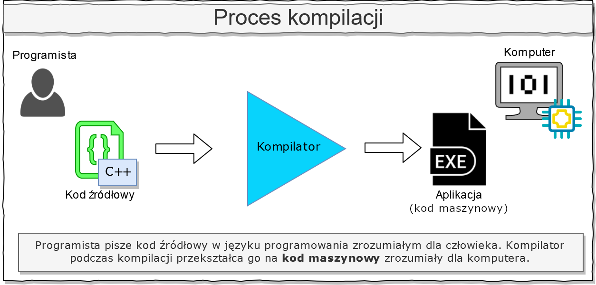

# Wprowadzenie

- [Wprowadzenie](#wprowadzenie)
- [Pobieramy Visual Studio Code](#pobieramy-visual-studio-code)
- [Tworzenie pierwszego programu](#tworzenie-pierwszego-programu)
- [Kompilacja kodu źródłowego](#kompilacja-kodu-%c5%bar%c3%b3d%c5%82owego)
	- [Proces kompilacji](#proces-kompilacji)
	- [Instalacja kompilatora GCC (MinGW-w64)](#instalacja-kompilatora-gcc-mingw-w64)
- [Kompilacja i uruchamianie aplikacji w Visual Studio Code](#kompilacja-i-uruchamianie-aplikacji-w-visual-studio-code)

Programowanie sprowadza się przede wszystim do pisania kodu,
który zapiszemy do pliku tekstowego o rozszerzeniu `.cpp`.
Możemy do tego korzystać nawet z prostego notatnika:


To może nie być jednak najwygodniejsze rozwiązanie.
Notatnik jest przeznaczony do edycji prostego tekstu.
Zamiast tego skorzystamy z profesjonalnego i darmowego edytora
kodu – **Visual Studio Code**. Jest on wzbogacony o:

- wbudowaną konsolę poleceń
- podświetlanie składni języka C++
- automatyczne podpowiedzi

... i wiele innych ciekawych funkcji, które ułatwiają
programowanie. Ważnym atutem jest też **ciemny motyw**,
który jest przyjemniejszy dla oka.

# Pobieramy Visual Studio Code

Pobierzmy plik instalacyjny z oficjalnej strony edytora:

[https://code.visualstudio.com](https://code.visualstudio.com)

Ja wybrałem paczkę *System Installer*, ponieważ chcę,
aby VS Code był dostępny dla wszystkich użytkowników
na moim komputerze.


# Tworzenie pierwszego programu

Stwórz na komputerze nowy folder, przeznaczony pod
pierwszy program. Jeśli podczas procesu instalacji
zaznaczyłeś opcję

> Add „Open with Code” action to Windows Explorer directory context menu

to możesz otworzyć stworzony folder w edytorze,
bezpośrednio z wnętrza folderu (1). W innym wypadku,
możesz też otworzyć folder już po uruchomieniu VS Code (2).


Teraz, za pomocą skrótu `Ctrl + N` lub menu `File -> New File`
utwórz nowy plik i zapisz go z nazwą "`Main.cpp`".
Edytor najprawdopodobniej zaproponuje Ci instalację dodatku
o nazwie "`C/C++`", zrób to. Przyjęło się nadawać właśnie tą
nazwę głównemu plikowi z kodem źródłowym programu.
Zapisz do niego ten kod:

```cpp
#include <iostream>
int main()
{
	std::cout << "Witaj swiecie!";
}
```

# Kompilacja kodu źródłowego

Kod programu (plik "`Main.cpp`") jest już gotowy, ale żeby
zobaczyć efekty pracy musisz najpierw wykonać
jeszcze jeden krok.

## Proces kompilacji

Komputer nie jest w stanie zrozumieć bezpośrednio języka C++,
który ma być czytelny dla człowieka, więc musi on zostać
najpierw "przetłumaczony" na kod maszynowy.
Dopiero wtedy możesz uruchomić swój program.
To właśnie w uproszczeniu jest **kompilacja**.
Aby to zrobić potrzebujesz kompilatora.
Jednym z takich kompilatorów jest **GCC**, zawarty w paczce
**`MinGW-w64`** i właśnie z niego skorzystamy.



## Instalacja kompilatora GCC (MinGW-w64)

Wyszukaj frazę "`MinGW-w64`" w wyszukiwarce, lub przejdź
bezpośrednio na stronę projektu na portalu SourceForge:

[https://sourceforge.net/projects/mingw-w64/](https://sourceforge.net/projects/mingw-w64/)

W karcie **Files**, na dole strony, znajdziesz listę gotowych
do pobrania paczek. Wybierz najnowszą wersję kompilatora
i paczkę **x86_64-posix-seh**. Na moment pisania artykułu,
najnowszą dostępną wersją jest paczka z GCC 8.1.0:


Pobrany kompilator rozpakowujemy do jakiegoś folderu na dysku,
np. w moim wypadku jest to `C:\Program Files\MinGW-w64`.
Następnie do zmiennej środowiskowej **PATH** systemu Windows
musimy dodać ścieżkę do folderu **/bin** znajdującego się
wewnątrz rozpakowanego kompilatora, czyli np. u mnie
jest to `C:\Program Files\MinGW-w64\bin`.
Jeśli nie wiesz jak to zrobić, to wyszukaj poradnik
w wyszukiwarce:

[Google: jak zmienić zmienną środowiskową PATH](http://lmgtfy.com/?q=jak+zmieni%C4%87+zmienn%C4%85+%C5%9Brodowiskow%C4%85+path)

Pokazałem też jak to zrobić w Windows 10 na poniższej ilustracji:


Jeśli wszystko zrobiliśmy poprawnie, będziemy mogli
skompilować nasz program.

# Kompilacja i uruchamianie aplikacji w Visual Studio Code

Teraz masz już wszystko czego potrzebujesz:

- edytor kodu,
- kompilator,
- kod źródłowy pierwszego programu.

Edytor posiada wbudowany terminal, który możesz otworzyć
skrótem klawiszowym <code>Ctrl + \`</code> (klawisz tyldy)
lub przez menu `View -> Terminal`. **Wprowadź do niego
następujące polecenie, które skompiluje program:**


Następnie, aby uruchomić utworzony program (`MojProgram.exe`),
wpisz polecenie:

`.\MojProgram`

Cały proces możesz zobaczyć na tym jednym GIFie:


Efektem wykonania tego programu jest wyświetlenie w konsoli
napisu "`Witaj świecie`", który znajduje się w pliku `Main.cpp`.